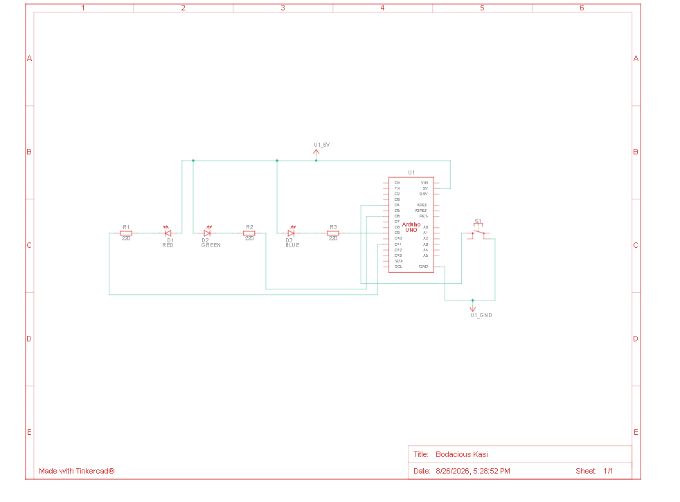

# Pokeball-Arduino-Simulator
A pokeball (an item from an pokemon animator) catching sequence simulator using arduino 

Description:
   - It is a small project that includes the main function of the pokeball
   - This project reflects the basic pokeball logic of pokemon catching
   - It includes 5 pokemons of different spawn rates and different catch rate
   - I loved pokemon a lot and i am an engineer too so i wanted to create a thing that concides with each other
   - The hardest part for me is the integration of catch and spawn rate
   

FEATURES :
   - Pokeball shake animation through blinking LEDs
   - Different pokemon rarity has different led indicator at the end (RESULT)
   - 5 pokemons can be obtained 
   - It has catch rate for catching pokemon
   - It also calculates spawn rate to choose which pokemon is chosen for catching
   - It has different states for easy flow
   - only supports RGB leds (single)

HARDWARE:
   - ARDUINO UNO R3   x1
   - RGB leds         x1
   - Push Button      x1
   - Resistor 220ohm  x1
   - Jumper Wire      x1

CIRCUIT:

    

USUAGE:
   - To use first press button while its in IDLE state
   - After that "The led will turn on" going into READY TO THROW STATE
   - then another press will intiate the catching sequence
   - Then after catching sequence based on the catch and spawn rate you will have a RESULT

FUTURE IMPROVEMENTS:
   - Much better Animations
   - Refactoring code with better techniques
   - Add a buzzer for more immersive experience
   - Add a OLED display for visual interaction
   - Add a movable platform to simulate pokeball shake
   - Create a 3d printed shell for proper pokeball